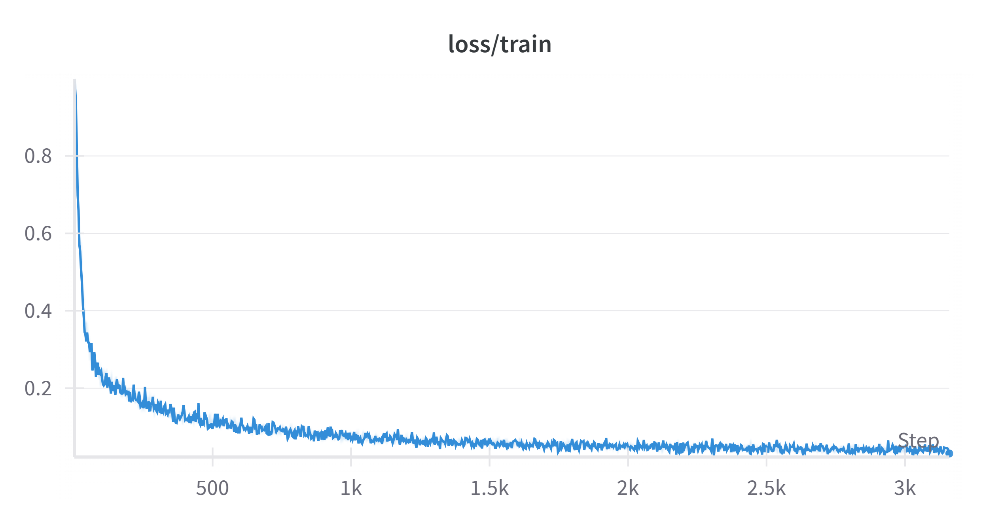
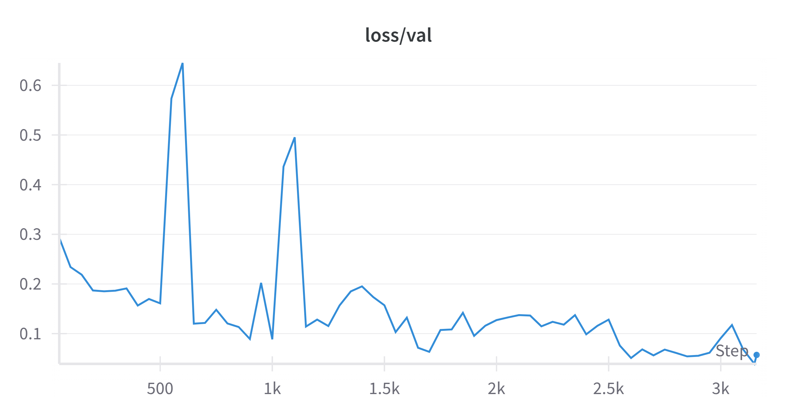
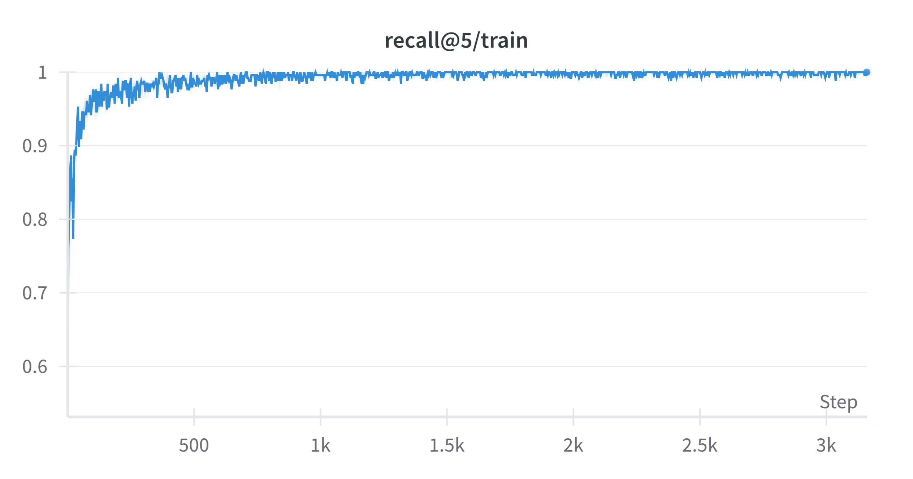
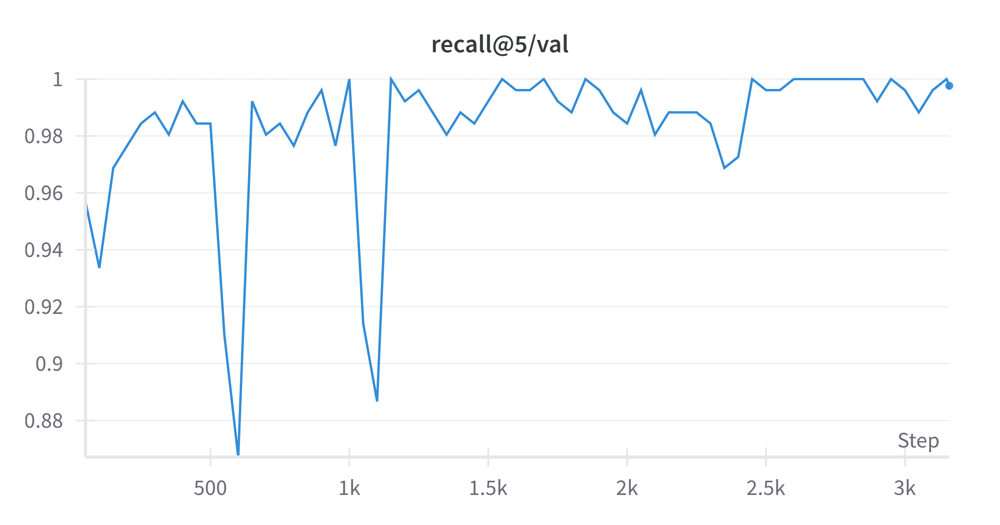

# Two-Tower Retrieval Model
This project was week 2 of the [Machine Learning Institute's](https://ml.institute/learn) 6 week bootcamp. We tackled a search and retrieval problem. We used the open source MS MARCO dataset, curated by Bing, and train a model to embed new documents and search these with queries. 

My repository takes queries and their associated positive passages are encoded separately via two separate RNN encoders in the 'Two Tower' approach. Training uses a custom contrastive triplet loss with dynamic in-batch negatives. Once training is completed, the test portion of the data is embedded and stored to disk. New queries are then embedded and search across the document embeddings applied via dot product.

---

## 📦 Setup

1. **Install environment:**

   ```bash
   mamba env create -f conda_env.yml
   mamba activate two_tower_env
   ```

2. **WandB API key:** Create a `.env` in the repo root:

   ```text
   WANDB_API_KEY=your_key_here
   ```

3. **Download data & embeddings:** Get these from Google Drive (same folder):

   - `glove.6B.200d.txt` (original text file)
   - `embeddings.npy` (preprocessed +pad+unk)
   - `word_to_idx.pkl` (vocab map)

   Place **all three** files into the `data/` directory.

4. **Download inference artefacts (optional):** If you only want to run search, download into `outputs/`:

   - `two_tower_ckpt1.pt` (trained checkpoint)
   - `test_passage_embs.npy` (150k×H embedding array)
   - `test_passage_texts.pkl` (list of 150k passages)

   Use the same Google Drive link.

Drive link for downloads: [https://drive.google.com/drive/folders/1Qqkc7l10M8cFcyjlMhZ1\_Ll0Ipn-w3wb?usp=sharing](https://drive.google.com/drive/folders/1Qqkc7l10M8cFcyjlMhZ1_Ll0Ipn-w3wb?usp=sharing)

---

## 📋 Dataset Info

I used MS MARCO v2.1 train, validation and test splits saved as Parquet in `data/`.

| Column                  | Type          | Notes                                 |
| ----------------------- | ------------- | ------------------------------------- |
| `query`                 | string        | Raw user query                        |
| `passages.passage_text` | list[strings] | 10 candidate passages per query       |
| `passages.is_selected`  | list[ints]    | Labels (unused; all treated positive) |

See the notebooks section below for instructions on how to download this.

---

## 🔡 Vocab & Embeddings

We used GloVe: precomputed embedings for common tokens. It comes with embeddings and a token mapping. The additional <pad> and <unk> tokens can be added using `notebooks/add_tokens.ipynb`. The nltk library is then used to split language up into tokens and these the precomputed embeddings are used as the input layer to the model. We allow this layer to train during model training.

- **GloVe**: `glove.6B.200d.txt` from Stanford NLP.
- ``: N×200 float matrix = GloVe rows + `<pad>` + `<unk>`.
- ``: Python dict mapping token→row index in embeddings.

---

## 🧠 Model Overview

Defined in `scripts/train.py`:

- **RNNEncoder**: LSTM-based encoder for token sequences.
- **TwoTowerModel**: separate encoders for queries and passages.
- **Loss**: `full_batch_triplet_loss` with one negative sampled from other queries per positive.
- **Metrics**: `recall@1`, `recall@5`, and `gap`.

---

## 🚀 Training

Run full training (logs to WandB and saves checkpoint):

```bash
python -m scripts/train
```

- Checkpoints saved to `outputs/two_tower_ckpt1.pt` (one per epoch).
- Default runs 1 epoch over training data.

The training will output training loss and recall every batch, and log this for the validation set every 50 batches. Training on my RTX 4060 GPU took ~30mins. We can see the training loss and recall improve nicely, with similar results for the validation after it stabilises. The held out test data is then used for the demo search below in the inference pipeline.

| Training Loss | Validation Loss |
| :----------: | :-------------: |
|  |  |

| Training Recall@1 | Validation Recall@1 |
| :---------------: | :-----------------: |
|  |  |

---

## 🌐 Inference Pipeline

### 1. Precompute test passage embeddings

```bash
python -m scripts.embed_test_data
```

This reads the unseen test stored in `data/ms_marco_test.parquet`, uses the trained model to embed these and saves the outputs to `outputs/`:

- `test_passage_embs.npy`: [150k, H] float32 array
- `test_passage_texts.pkl`: list of 150k raw strings
As mentioned above, these are precomputed and available on google drive.


### 2. Search queries
Now we can enter a query in natural language and search the documents. The model will embed this query and do the dot product search. Here's an example query and output:

```bash
python -m scripts.search --query "best football player" --top_k 5
```

**Example output:**

```
Top 5 results for query: "best football player"

1. (score=43.1468) 8. How many NBA G League players have made it to the NBA? ...
2. (score=41.4281) Only player in NBA history to average 28 points, 8 rebounds, and 6 assists ...
3. (score=41.2863) Only player in NBA history to average at least 35 points, 10 rebounds, ...
4. (score=40.9231) Home > Players > Active players NBA players 2017-18 season ...
5. (score=40.9077) Six players have been drafted into the NBA out of the NBA D-League. ...
```

> *NB: test split has \~150k passages, so the basketball references above are just how this subset happened to be built, not bad otherwise!!*

---

## 📝 Notebooks

- `notebooks/download_dataset.ipynb`: fetch MS MARCO splits
- `notebooks/add_tokens.ipynb`: append `<pad>`/`<unk>` to embeddings
- `notebooks/embeddings_processing.ipynb`

---

## 📚 Citation

> MS MARCO: [https://huggingface.co/datasets/microsoft/ms\_marco](https://huggingface.co/datasets/microsoft/ms_marco)

---

## 💡 Some nice to do's which would be good additions
1. I could extract actual queries from the test data, run these, and compare the recall of the actual documents bing found.
2. Implement a second model which focuses on precision. The first could be used to output a top 100, the second could be used to pick the best outputs from this.

---

## 🗂 Directory Structure

```
.
├── conda_env.yml                # Environment setup with Mamba
├── data/                        # Parquet splits, embeddings, token map
│   ├── glove.6B.200d.txt        # Original GloVe vectors (download from Google Drive)
│   ├── embeddings.npy           # GloVe+<pad>+<unk> matrix (download from Google Drive)
│   ├── word_to_idx.pkl          # Token→index mapping (download from Google Drive)
│   ├── ms_marco_train.parquet   # Training split
│   ├── ms_marco_validation.parquet
│   └── ms_marco_test.parquet    # Test split
├── misc/                        # Debug and exploration scripts
├── notebooks/                   # Dataset download, token updates, tests
│   ├── download_dataset.ipynb
│   ├── add_tokens.ipynb
│   └── embeddings_processing.ipynb
├── outputs/                     # Inference artefacts
│   ├── test_passage_embs.npy    # [N×H] embeddings of test passages
│   ├── test_passage_texts.pkl   # List of original test passage strings
│   └── two_tower_ckpt1.pt       # Trained model checkpoint (downloadable)
├── scripts/                     # Core code
│   ├── config.py                # Global configs
│   ├── dataloader.py            # Data loading & processing
│   ├── train.py                 # Training loop, model, metrics
│   ├── embed_test_data.py       # Precompute test-passage embeddings
│   └── search.py                # Query encoding & brute-force search
└── README.md                    # This file
```

---